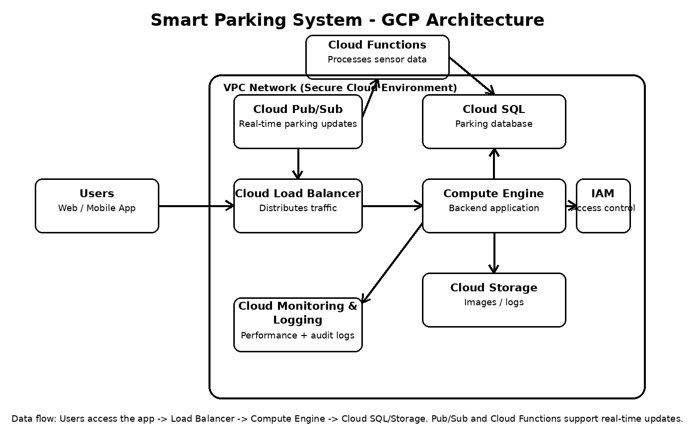

# Cloud Architecture

## Overview
The Campus Smart Parking System is a cloud-based application designed to help university students find available parking in real time. The system collects parking availability updates, processes them through cloud services, stores the data, and displays current parking information to users.

## Architecture Goal
The goal of this architecture is to provide a scalable, secure, and reliable system for monitoring parking availability across a university campus.

## Architecture Diagram

## Main Components
- User interface for students
- Cloud Load Balancer
- Compute Engine (backend application)
- Cloud Functions
- Pub/Sub
- Firestore
- Cloud Storage
- Cloud IAM
- Cloud Logging
- Cloud Monitoring
- Secret Manager

## How the System Works
1. Parking availability data is collected from parking lot inputs, sensors, or manual updates.
2. The update is sent through Pub/Sub for event-driven processing.
3. Cloud Functions receive the event and process the parking data.
4. The processed data is stored in Firestore.
5. Students access the system through a web or mobile interface.
6. The application retrieves the latest parking availability from Firestore.
7. Cloud Load Balancing distributes traffic efficiently.
8. Compute Engine hosts the backend logic of the application.
9. Cloud Logging and Cloud Monitoring track system activity, errors, and performance.
10. Secret Manager protects sensitive credentials and configuration values.
11. IAM controls access to cloud resources and limits unauthorized use.

## Data Flow
Parking Update Source → Pub/Sub → Cloud Functions → Firestore → Backend (Compute Engine) → Student Application

## Security in the Architecture
- IAM restricts access to resources
- Secret Manager protects secrets and keys
- Logging and monitoring support threat detection
- Encrypted communication protects data in transit

## Scalability
This architecture is scalable because cloud services automatically adjust to handle increased demand. As more students use the application, the system continues to perform efficiently without requiring manual infrastructure changes.

## Reliability
The system is designed to remain available and responsive by using managed cloud services, monitoring tools, and load balancing to prevent downtime.

## Summary
This architecture supports real-time parking updates for university students while maintaining security, scalability, and reliability in a cloud environment.
